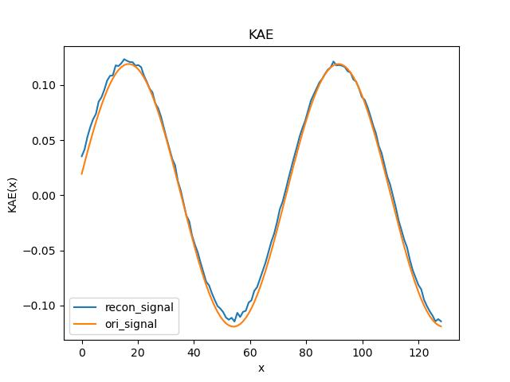
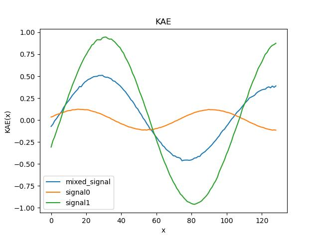
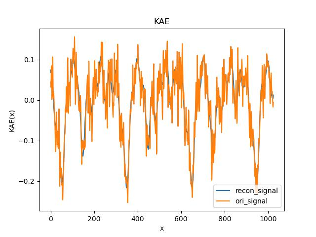

# KAE:KAN-AutoEncoder
This repo is heavily based on [Blealtan's implement of KAN](https://github.com/Blealtan/efficient-kan). The original implementation of KAN is available [here](https://github.com/KindXiaoming/pykan).

## Motivation
Intuitively, KAN seems a natural good representation of signals, especialy of audio signals which can be decomposed into sinusoidal signals.

Thus, this repo is created to investigate the potential of KAN to represent the sinusoidal signals and even more complicated signals.

## How to use
Here I create two Juypter notebooks, one for [KAN-based AutoEncoder](https://github.com/SekiroRong/KAN-AutoEncoder/blob/main/KAE.ipynb) and another for [MLP-based AutoEncoder](https://github.com/SekiroRong/KAN-AutoEncoder/blob/main/MAE.ipynb).

My toy example shows that KAN is way better than MLP in representing sinusoidal signals, which may indicate the great potential of KAN to be the new baseline of AutoEncoder.

## List of supported KAN-based Autoencoders
* [KAE](https://github.com/SekiroRong/KAN-AutoEncoder/blob/main/KAE.ipynb)

* [KVAE](https://github.com/SekiroRong/KAN-AutoEncoder/blob/main/KVAE.ipynb)

* [KVQ-VAE](https://github.com/SekiroRong/KAN-AutoEncoder/blob/main/KVQ-VAE.ipynb)

* [KAN-RVQ](https://github.com/SekiroRong/KAN-AutoEncoder/blob/main/KRVQ.ipynb)

## Results & Interesting Findings
Firstly, KAE is able to compress a 128-dimension unseen sinusoidal signal into 5 dimensions and reconstruct the signal back to 128 dimensions approximately lossless:

Another interesting finding is KAE can be utilised as a mixer for two different signals:

Then I try to scale up the [experiments](https://github.com/SekiroRong/KAN-AutoEncoder/blob/main/Music_Genres.ipynb), using real music sequence instead of toy dimensional signals, the dataset I use can be found [here](https://www.kaggle.com/datasets/andradaolteanu/gtzan-dataset-music-genre-classification/data).

It turns out that, KAN is able to reconstruct real, noisy, comlicate music sequence with few parameters:

And still can be utilised as a mixer for different audio signals.

Here is a [KAN-based VAE model](https://github.com/SekiroRong/KAN-AutoEncoder/blob/main/KVAE.ipynb), a [KAN-based VQ-VAE model](https://github.com/SekiroRong/KAN-AutoEncoder/blob/main/KVQ-VAE.ipynb) and a * [KAN-based RVQ model](https://github.com/SekiroRong/KAN-AutoEncoder/blob/main/KRVQ.ipynb).

RVQ model seems converge way slower than vanilla VQ-VAE. Maybe the average strategy to update the codebook leads to this slow converge?
